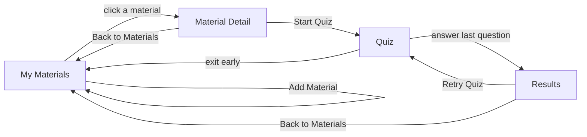

# TaskIt

## Wireframes and component breakdown

**Course / Class Code:** 6APSI / 2240
**GitHub:** [Le1fux](https://github.com/Le1fux)

## Step A: Screen map

The first screen is My Materials, which is also the home base. The main
navigation on every other screen links back to it.

Navigation actions:

- My Materials -> Material Detail: click a material.
- My Materials -> My Materials: submit Add Material; the new material appears
  in the list.
- Material Detail -> Quiz: click Start Quiz.
- Quiz -> Results: answer the last question.
- Results -> Quiz: click Retry Quiz; the quiz restarts from question 1.
- Material Detail, Quiz, and Results -> My Materials: click Back to Materials.

There are no dead ends: every screen has a path back toward My Materials, and
Results also has a forward path through Retry Quiz.

## Step B: Box-sketch per screen

Each screen is designed for desktop and phone widths. Dashed groups represent
component sections, while the header and buttons are primary visual controls.

| Screen | Desktop layout | Phone layout | Navigates to |
| --- | --- | --- | --- |
| My Materials | Header and navigation. Add Material form with title input, study-material textarea, and submit button. Saved material cards below. | Navigation collapses. Form fields become full-width and stack. Material cards become one column. | Material Detail, My Materials |
| Material Detail | Header and navigation. Material title and content, practice-question list, Add Question form, edit/delete controls, and Start Quiz button. | Navigation collapses. Material content, question list, and form stack vertically. Question controls wrap or become full-width. | Quiz, My Materials |
| Quiz | Header and navigation. Progress indicator, centered question card, Show Answer button, revealed answer area, right/wrong controls, and running-score footer. | Navigation collapses. Content becomes one centered column. The question card uses the available width and buttons stack when needed. | Results, My Materials |
| Results | Header and navigation. Final score, missed questions on the left, past attempts on the right, Retry Quiz, and Back to Materials. | Navigation collapses. Score, missed questions, past attempts, and buttons stack vertically. | Quiz, My Materials |

### Screen content

#### My Materials

The home screen contains the TaskIt header, an Add Material form, and a list of
saved material cards. Each card links to the corresponding material detail
route.

#### Material Detail

The detail screen contains the material title and content, practice questions,
an Add Question form, edit/delete controls, and a Start Quiz action.

#### Quiz

The quiz screen contains a progress indicator, one question card, a Show Answer
control, a revealed answer area, self-grading buttons, and a running score.

#### Results

The results screen contains the final score, missed questions from the current
attempt, past attempts for the same material, and Retry Quiz and Back to
Materials actions.

## Step C: Component tree

| Level | Purpose | Components |
| --- | --- | --- |
| Atoms | Smallest reusable pieces | Button, Input, Textarea, Icon, ScoreBadge |
| Molecules | Small groups of atoms that work together | MaterialCard, MaterialForm, QuestionForm, QuestionItem, QuestionCard, ResultRow, AttemptRow |
| Organisms | Larger sections made from smaller components | Header, MaterialList, QuestionList, QuizPanel, ResultsList, AttemptList |
| Page / layout | Screens that arrange organisms | MaterialsPage, MaterialDetailPage, QuizPage, ResultsPage |

Repeated components:

- `MaterialCard` repeats on My Materials, one card per saved material, rendered
  with `key={material.id}`.
- `QuestionItem` repeats on Material Detail, one row per question with Edit and
  Delete controls.
- `QuestionCard` is the single question shown at a time inside QuizPanel.
- `ResultRow` repeats on Results for each question missed in the latest attempt.
- `AttemptRow` repeats on Results for each past attempt on the same material.

Each level only uses components from the levels below it, so an atom never
imports an organism.

## Step D: Sanity check

The main user task is: add study material, create questions, and quiz myself.

1. Land on My Materials, the home base.
2. Use Add Material to enter a title and paste in study material.
3. Submit the form; the new material appears in the material list.
4. Click the material; Material Detail opens and shows its content.
5. Add question-and-answer pairs with the Question Form.
6. Edit or delete questions as needed.
7. Click Start Quiz; Quiz opens with the first question and `currentIndex = 0`.
8. Click Show Answer; the answer is revealed.
9. Click I got it right or I got it wrong; score and missed IDs update, then the
   next question appears.
10. Answer the last question; the attempt is saved and the app navigates to
    Results.
11. Results shows the final score, missed questions, and past attempts.
12. Click Retry Quiz; the quiz restarts with `currentIndex`, score, and missed
    IDs reset.
13. Click Back to Materials; My Materials opens without changing saved
    materials or questions.

## State ownership check

| State | Owner | Why |
| --- | --- | --- |
| `materials` | App | My Materials and Material Detail both read it. |
| `questions` | App | Material Detail edits it and Quiz reads it. |
| `results` | App | Results reads saved scores and missed questions. |
| `score` | App | Results needs it after the quiz ends. |
| `missedIds` | App | Results needs it after the quiz ends. |
| `currentIndex` | QuizPage | It only matters while a quiz is running. |
| `answerRevealed` | QuizPage | It only matters while a quiz is running. |

App owns the data shared between routes, while QuizPage owns temporary state
that only matters during an active quiz.

## Results of the check

- All four routes from the proposal are included.
- Every screen can return to My Materials.
- The main user task has a complete start-to-finish path.
- Every important piece of state has a clear owner.
- The core version does not depend on AI-generated questions; users create and
  manage question-and-answer pairs.
- AI-generated questions remain a stretch goal and do not change this structure.

## Implementation status

The current scaffold already provides the four routes, shared Header, responsive
Tailwind layout, quiz reveal and self-grading controls, progress bar, results
view, and attempt-history placeholders. Material persistence, editable question
management, and backend-backed state are planned for the next implementation
increment.
